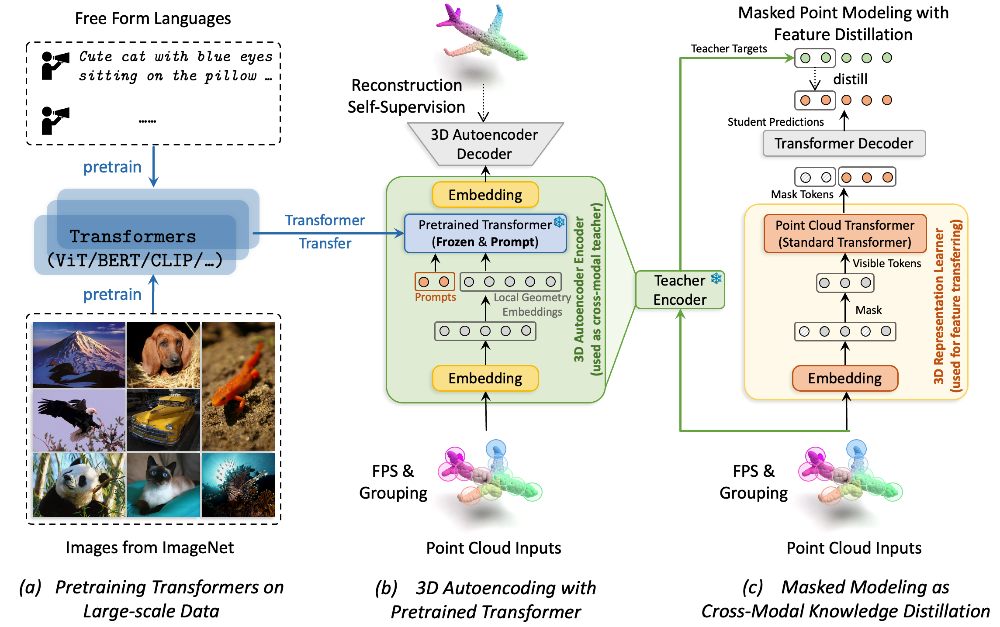

# Autoencoders as Cross-Modal Teachers

Created by [Runpei Dong](https://runpeidong.com), [Zekun Qi](https://github.com/qizekun), [Linfeng Zhang](https://scholar.google.com.hk/citations?user=AK9VF30AAAAJ&hl=en&oi=ao), [Junbo Zhang](https://scholar.google.com.hk/citations?user=rSP0pGQAAAAJ&hl=en), [Jianjian Sun](https://scholar.google.com.hk/citations?user=MVZrGkYAAAAJ&hl=en&oi=ao), [Zheng Ge](https://scholar.google.com.hk/citations?user=hJ-VrrIAAAAJ&hl=en&oi=ao), [Li Yi](https://ericyi.github.io/), [Kaisheng Ma](http://group.iiis.tsinghua.edu.cn/~maks/leader.html)

[OpenReview](https://openreview.net/forum?id=8Oun8ZUVe8N) | [arXiv](https://arxiv.org/abs/2212.08320) | [Models](https://drive.google.com/drive/folders/1hZUmqRvAg64abnkaI1HxctfQPTetWpaH?usp=share_link)

This repository contains the code release of paper **Autoencoders as Cross-Modal Teachers: Can Pretrained 2D Image Transformers Help 3D Representation Learning?** (ICLR 2023).

## ACT:clapper:

The success of deep learning heavily relies on large-scale data with comprehensive labels, which is more expensive and time-consuming to fetch in 3D compared to 2D images or natural languages. This promotes the potential of utilizing models pretrained with data more than 3D as teachers for cross-modal knowledge transferring. In this paper, we revisit masked modeling in a unified fashion of knowledge distillation, and we show that foundational Transformers pretrained with 2D images or natural languages can help self-supervised 3D representation learning through training **A**utoencoders as **C**ross-Modal **T**eachers (**ACT**:clapper:). The pretrained Transformers are transferred as cross-modal 3D teachers using discrete variational autoencoding self-supervision, during which the Transformers are frozen with prompt tuning for better knowledge inheritance. The latent features encoded by the 3D teachers are used as the target of masked point modeling, wherein the dark knowledge is distilled to the 3D Transformer students as foundational geometry understanding. Our ACT pretrained 3D learner achieves state-of-the-art generalization capacity across various downstream benchmarks, e.g., 88.21% overall accuracy on ScanObjectNN.

<div  align="center">    
 
</div>
## News

- 📌 Feb, 2023: Check out our latest work [**ReCon**](https://arxiv.org/abs/2302.02318), which achieves **91.26%** accuracy on ScanObjectNN
- 💥 Jan, 2023: [**ACT**](https://arxiv.org/abs/2212.08320) accepted by ICLR 2023

## Environment

This codebase was tested with the following environment configurations. It may work with other versions.
- Ubuntu 18.04
- CUDA 11.3
- GCC 7.5.0
- Python 3.8.8
- PyTorch 1.10.0

## 1. Installation
We recommend using Anaconda for the installation process:
```shell
# Make sure `g++-7 --version` is at least 7.4.0
$ sudo apt install g++-7  # For CUDA 10.2, must use GCC < 8

# Create virtual env and install PyTorch
$ conda create -n act python=3.8.8
$ conda activate act

(act) $ conda install openblas-devel -c anaconda
(act) $ conda install pytorch==1.10.0 torchvision==0.11.0 cudatoolkit=11.3 -c pytorch -c nvidia
# Or, you can set up Pytorch with pip from official link:
# (act) $ pip install torch==1.10.0+cu113 torchvision==0.11.0+cu113 torchaudio==0.10.0+cu113 -f https://download.pytorch.org/whl/torch_stable.html # recommended
# For CUDA 10.2, use conda:
# (act) $ conda install pytorch==1.11.0 torchvision==0.12.0 torchaudio==0.11.0 -c pytorch -c nvidia
# Or pip:
# (act) $ pip install torch==1.11.0+cu102 torchvision==0.12.0+cu102 torchaudio==0.11.0 --extra-index-url https://download.pytorch.org/whl/cu102

# Install basic required packages
(act) $ pip install -r requirements.txt

# Chamfer Distance
(act) $ cd ./extensions/chamfer_dist && python setup.py install --user
# PointNet++
(act) $ pip install "git+https://github.com/erikwijmans/Pointnet2_PyTorch.git#egg=pointnet2_ops&subdirectory=pointnet2_ops_lib"
# GPU kNN
(act) $ pip install --upgrade https://github.com/unlimblue/KNN_CUDA/releases/download/0.2/KNN_CUDA-0.2-py3-none-any.whl
```

## 2. Datasets

We use ShapeNet, ScanObjectNN, ModelNet40, S3DIS and ShapeNetPart in this work. See [DATASET.md](./DATASET.md) for details.

## 3. Models

The models and logs have been released on [Google Drive](https://drive.google.com/drive/folders/1hZUmqRvAg64abnkaI1HxctfQPTetWpaH?usp=share_link). See [MODEL_ZOO.md](./model_zoo/MODEL_ZOO.md) for details.

## 4. ACT Pre-training
To pretrain ACT on the ShapeNet training set, run the following command. If you want to try different models or masking ratios etc., first create a new config file, and pass its path to --config.

ACT pretraining includes two stages:

* Stage I, transferring pretrained Transformer on ShapeNet as 3D autoencoder by running:

  ```shell
  CUDA_VISIBLE_DEVICES=<GPUs> python main_autoencoder.py \
      --config "cfgs/autoencoder/act_dvae_with_pretrained_transformer.yaml" \
      --exp_name <output_file_name>
  ```

  or

  ```shell
  sh train_autoencoder.sh <GPU>
  ```

* Stage II, pretrain 3D Transformer student on ShapeNet by running:

  ```shell
  CUDA_VISIBLE_DEVICES=<GPUs> \
      python main.py --config "cfgs/pretrain/pretrain_act_distill.yaml" \
      --exp_name <output_file_name>
  ```

  or

  ```shell
  sh pretrain.sh <GPU>
  ```

## 5. ACT Fine-tuning

Fine-tuning on ScanObjectNN, run:
```shell
CUDA_VISIBLE_DEVICES=<GPUs> python main.py --config cfgs/finetune_classification/full/finetune_scan_hardest.yaml \
--finetune_model --exp_name <output_file_name> --ckpts <path/to/pre-trained/model>
```
Fine-tuning on ModelNet40, run:
```shell
CUDA_VISIBLE_DEVICES=<GPUs> python main.py --config cfgs/finetune_classification/full/finetune_modelnet.yaml \
--finetune_model --exp_name <output_file_name> --ckpts <path/to/pre-trained/model>
```
Voting on ModelNet40, run:
```shell
CUDA_VISIBLE_DEVICES=<GPUs> python main.py --test --config cfgs/finetune_classification/full/finetune_modelnet.yaml \
--exp_name <output_file_name> --ckpts <path/to/best/fine-tuned/model>
```
Few-shot learning, run:
```shell
CUDA_VISIBLE_DEVICES=<GPUs> python main.py --config cfgs/finetune_classification/few_shot/fewshot_modelnet.yaml --finetune_model \
--ckpts <path/to/pre-trained/model> --exp_name <output_file_name> --way <5 or 10> --shot <10 or 20> --fold <0-9>
```
Semantic segmentation on S3DIS, run:
```shell
cd semantic_segmentation
python main.py --ckpts <path/to/pre-trained/model> --root path/to/data --learning_rate 0.0002 --epoch 60
```

## 6. Visualization
Reconstruction results of synthetic objects from ShapeNet test set. We show the comparison of our ACT autoencoder and Point-BERT dVAE model:
<div  align="center">    
 
</div>


## License
ACT is released under the MIT License. See the [LICENSE](./LICENSE) file for more details. Besides, the licensing information for `pointnet2` modules is available [here](https://github.com/erikwijmans/Pointnet2_PyTorch/blob/master/UNLICENSE).

## Acknowledgements
Many thanks to the following codes that help us a lot in building this codebase:
* [Point-BERT](https://github.com/lulutang0608/Point-BERT)
* [Point-MAE](https://github.com/Pang-Yatian/Point-MAE)
* [VPT](https://github.com/KMnP/vpt)
* [Pointnet2_PyTorch](https://github.com/erikwijmans/Pointnet2_PyTorch)

## Contact

If you have any questions related to the code or the paper, feel free to email Runpei (`runpei.dong@gmail.com`). If you encounter any problems when using the code, or want to report a bug, you can open an issue. Please try to specify the problem with details so we can help you better and quicker!

## Citation

If you find our work useful in your research, please consider citing:
```latex
@inproceedings{dong2023act,
  title={Autoencoders as Cross-Modal Teachers: Can Pretrained 2D Image Transformers Help 3D Representation Learning?},
  author={Runpei Dong and Zekun Qi and Linfeng Zhang and Junbo Zhang and Jianjian Sun and Zheng Ge and Li Yi and Kaisheng Ma},
  booktitle={The Eleventh International Conference on Learning Representations (ICLR) },
  year={2023},
  url={https://openreview.net/forum?id=8Oun8ZUVe8N}
}
```
